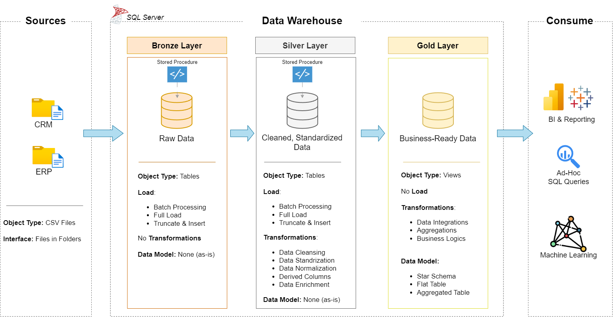

# Data Warehouse STAR Schema Project

**Data Warehouse STAR Schema Project** repository! 🚀  
End-to-end implementation of a star schema data warehouse for efficient storage and querying.

---
## 🏗️ Data Architecture

The data architecture for this project follows Medallion Architecture **Bronze**, **Silver**, and **Gold** layers:


1. **Bronze Layer**: Stores raw data as-is from the source systems. Data is ingested from CSV Files into SQL Server Database.
2. **Silver Layer**: This layer includes data cleansing, standardization, and normalization processes to prepare data for analysis.
3. **Gold Layer**: Houses business-ready data modeled into a star schema required for reporting and analytics.

---
## 📖 Project Overview

This project focuses on building a **scalable data warehouse** by applying industry best practices in data engineering and database design.  

### Key Aspects:  
- **Source Integration**: Combining datasets from ERP and CRM systems into a unified warehouse.  
- **Data Transformation**: Cleaning, deduplicating, and applying business rules.  
- **Schema Design**: Implementing a **star schema** with fact and dimension tables.  
- **Data Flow & Governance**: Maintaining data lineage and relationships across layers.

---

## ✨ Features  

- Multi-layered **Medallion Architecture** (Bronze, Silver, Gold).  
- **ETL Pipelines** for structured data movement.  
- **Star Schema** data modeling for optimized queries.  
- Clear **documentation & diagrams** for architecture, data flow, and schema.  
- **Test scripts** for validating transformations and data quality.  

---

## 🛠 Tech Stack  

- **Database**: SQL Server  
- **ETL / Transformation**: SQL Scripts  
- **Source Data**: CSV files (ERP & CRM datasets)  
- **Version Control**: Git & GitHub  
- **Documentation**: Draw.io for diagrams, Markdown for docs

---

## 📂 Repository Structure
```
data-warehouse-project/
│
├── datasets/                           # Raw datasets used for the project (ERP and CRM data)
│
├── docs/                               # Project documentation and architecture details
│   ├── data_architecture.png           # Draw.io file shows the project's architecture
│   ├── data_flow.png                   # Draw.io file for the data flow diagram
│   ├── data_model.png                  # Draw.io file for data models (star schema)
│   ├── data_integration.png            # Draw.io file for how tables are related 
│
├── scripts/                            # SQL scripts for ETL and transformations
│   ├── bronze/                         # Scripts for extracting and loading raw data
│   ├── silver/                         # Scripts for cleaning and transforming data
│   ├── gold/                           # Scripts for creating analytical models
│
├── tests/                              # Test scripts and quality files
│
├── README.md                           # Project overview and instructions
├── LICENSE                             # License information for the repository
```
